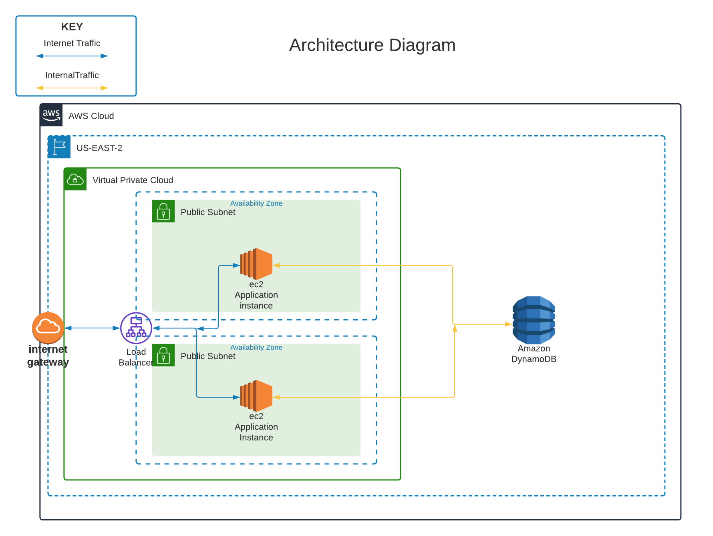
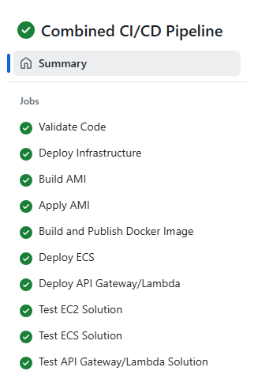
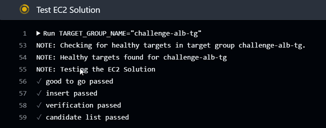
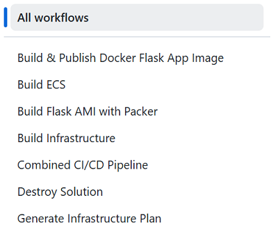
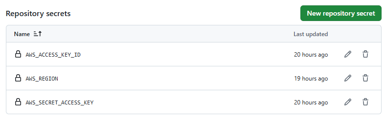

AWS Code Examples
=========================================

This project demostrates the following.

- **Using Terraform** to build AWS components
- **Building a simple network**
- **Deploying DynamoDB** as a backend for simple Python-based microservices
- **Building an AMI** with Packer
- **Building a Docker container** and pushing the build to ECR
- **Deploying simple Python-based microservices**:
  - With autoscaling EC2 instances
  - With containers via ECS
  - With Lambda and API Gateway
- **Using principles of least privilege** when creating necessary IAM roles
- **Building the complete architecture** with GitHub Actions
- **Extensive Bash shell scripting** leveraging the AWS CLI



This solution deploys a very simple set of HTTP endpoints written in the python. These endpoints are deployed on a EC2 instance, a container deployed with ECS, and a lambda version deployed with API Gateway.

### HTTP Endpoint Summary

### `/gtg` (GET)
- **Purpose**: Health check.
- **Response**: 
  - `{"connected": "true", "instance-id": <instance_id>}` (if `details` query parameter is provided).
  - 200 OK with no body otherwise.

### `/candidate/<name>` (GET)
- **Purpose**: Retrieve a candidate by name.
- **Response**: 
  - Candidate details (JSON) with status `200`.
  - `"Not Found"` with status `404` if no candidate is found.

### `/candidate/<name>` (POST)
- **Purpose**: Add or update a candidate by name.
- **Response**: 
  - `{"CandidateName": <name>}` with status `200`.
  - `"Unable to update"` with status `500` on failure.

### `/candidates` (GET)
- **Purpose**: Retrieve all candidates.
- **Response**: 
  - List of candidates (JSON) with status `200`.
  - `"Not Found"` with status `404` if no candidates exist.


## Build Instructions

These build instructions assume you will be running from a Linux environment. The builds will work individually on Windows but the utility scripts "[apply.sh](apply.sh)", "[validate.sh](validate.sh)" and "[destroy.sh](destroy.sh)" are written in bash. 

### Prerequisites

* [Install AWS CLI](https://docs.aws.amazon.com/cli/latest/userguide/getting-started-install.html) 
* [Install Latest Terraform](https://developer.hashicorp.com/terraform/install)
* [Install Latest Packer](https://developer.hashicorp.com/packer/install)

NOTE: Make sure the aws, packer and terraform commands are all in your $PATH.

### Decide on Remote State Strategy

Since I've designed this solution to build with a github action I've configured this repository to use an [S3 backend](01-infrastructure/backend.tf).  There is some [bootstrapping terraform code](00-backend/main.tf) which needs to be built outside the context of the pipeline. The strategy I typically use is to put the account number in my S3 tfstate buckets to insure they are globally unique to AWS.

If you are planning to build outside of the pipeline as a first step simply comment out the [infrastructure backend.tf](01-infrastructure/backend.tf), [lambda backend.tf](05-lambda/backend.tf) and the [ecs backend.tf](04-ecs/backend.tf).

If you are planning to build with a remote state create your S3 bucket and dynamo locking table then modify the [infrastructure backend.tf](01-infrastructure/backend.tf), [lambda backend.tf](05-lambda/backend.tf) and the [ecs backend.tf](04-ecs/backend.tf) to use the new objects.

### Run "[apply.sh](apply.sh)" at the root level of the project

This script is divided into 6 phases.

1. **Deploy Infrastructure** - Build all the infrastructure from the diagram above with a generic Amazon Linux 2023 AMI which simulates the target flask health-checks using httpd. The httpd simulation allows the autoscaling cluster to initialize and pass all health checks.
2. **Build AMI** - Use packer to build the server providing the flask http end-points. 
3. **Apply AMI** - Re-apply the infrastucture terraform and pass in the AMI id built from the previous phase. This will create a new launch template version with the new AMI and tag as $LATEST.
4. **Build and Publish Docker Image** - Use docker to build the containerized version of the flask application and publish to ECR.
5. **Deploy ECS** - Deploy the containerized version of the flask application with ECS
6. **Deploy API/Lambda** - Deploy the version of the application rewritten as Lambdas and deployed with API Gateway.

The **Combined CI/CD Pipeline** roughly follows these steps as well.



### Test the code with "[test_candidates.py](02-packer/scripts/test_candidates.py)"

Included in the CI/CD pipeline is a stage that tests the EC2 and ECS solution as part of the build process.



Also included is [validate.sh](validate.sh) for validating the solution outside the context of the pipeline.

```text
ubuntu@ip-10-1-0-11:~/uturndata-challenge$ ./validate.sh
NOTE: Checking for healthy targets in target group challenge-alb-tg.
NOTE: Healthy targets found on challenge-alb-tg.
NOTE: Testing the EC2 Solution
NOTE: URL for EC2 Solution is http://challenge-alb-2096975437.us-east-2.elb.amazonaws.com/gtg?details=true
✓ good to go passed
✓ insert passed
✓ verification passed
✓ candidate list passed
NOTE: Checking for healthy targets in target group ecs-tg.
NOTE: Healthy targets found on ecs-tg.
NOTE: Testing the ECS Solution.
NOTE: URL for ECS Solution is http://ecs-alb-213915415.us-east-2.elb.amazonaws.com/gtg?details=true
✓ good to go passed
✓ insert passed
✓ verification passed
✓ candidate list passed
https://7sz2uw5oql.execute-api.us-east-2.amazonaws.com
NOTE: Testing the API Gateway Solution.
NOTE: URL for API Solution is https://7sz2uw5oql.execute-api.us-east-2.amazonaws.com.
✓ good to go passed
✓ insert passed
✓ verification passed
✓ candidate list passed
```

### Run "[destroy.sh](destroy.sh)" to clean up everything

In addition to calling terraform destroy this script also deletes all AMIs built by packer, their associated snapshots and cleans out the ECR repository.

## CI/CD Pipelines

I've implemented several GitHub actions for building the solution. The main pipeline to build the complete solution is **Combined CI/CD Pipeline**. I started out with this one pipeline but added the other pipelines to make incremental development easier.



### Pipeline Configuration

1. Create the remote backend. I've provided [bootstrapping terraform](./00-backend/main.tf) to create the tfstate S3 bucket and dynamo lock table.
2. Modify [infrastructure backend.tf](./01-infrastructure/backend.tf), [lambda backend.tf](05-lambda/backend.tf) and [ecs backend.tf](04-ecs/backend.tf) to use the backend you've created.
3. Call terraform init to initialize the backend.
4. Within GitHub modify the settings for the project and inject the following repository secrets for your AWS account.

    * AWS_ACCESS_KEY_ID
    * AWS_REGION
    * AWS_SECRET_ACCESS_KEY



### Combined CI/CD Pipeline 

The [Combined CI/CD Pipeline](.github/workflows/build_all.yml) builds the complete solution. First it validates the terraform source and packer source files then invokes the 5 phases to build the complete solution. The last step in the pipeline validates the deployed ECS, EC2 and Lambda solution by calling [test_candidate.py](02-packer/scripts/test_candidates.py).

This pipeline is currently configured to run manually.

### Generate Infrastructure Plan

The [Generate Infrastructure Plan](.github/workflows/plan.yml) pipeline performs a terraform plan on the terraform. Originally I had this to run on push but this became way too noisy so I changed to only run manually.

### Build Infrastructure

The [Build Infrastructure](.github/workflows/infrastructure.yml) pipeline builds the solution's infrastructure. This pipeline must be run manually within the GitHub actions interface.

Run this first in a incremental build.

### Build Flask AMI with Packer

The [Build Flask AMI with Packer](.github/workflows/packer.yml) pipeline builds the flask AMI with Packer. This pipeline must be run manually within the GitHub actions interface.

Run this second in an incremental build. Once this is run you will need to re-run the **Build Infrastructure** to pick up the latest AMI.

### Build & Publish Docker Flask App Image

The [Build & Publish Docker Flask App Image](.github/workflows/docker.yml) pipeline builds the containerized version of the flask application with Docker. This pipeline must be run manually within the GitHub actions interface after the infrastructure is built.

### Build ECS

The [Build ECS](.github/workflows/ecs.yml) pipeline builds the ECS version of the solution. This pipeline must be run manually within the GitHub actions interface.
Run this last in a incremental build.

### Destroy Solution

The [Destroy Solution](.github/workflows/destroy.yml) pipeline destroys all the infrastructure, de-registers AMIs and deletes any snapshots associated with AMIs. This pipeline must be run manually within the GitHub actions interface.

## Code Walk Through 

There are 3 subfolders in this project. Each subfolder has a README that describes the code in more detail.

### [00-backend](./00-backend/)

This is utility terraform for configuring a remote state S3 bucket and dynamoDB lock table. This will need to be modified if you plan on running this solution in a different AWS account.

### [01-infrastucture](./01-infrastructure/)

This contains the terraform for the infrastucture deployed in the solution.

### [02-packer](./02-packer/)

This contains the packer code to build the AMI for the solution.

### [03-docker](./03-docker/)

This contains the containerized build of the Flask application.

### [04-ecs](./04-ecs/)

This contains the build for the ECS components.

### [05-lambda](./05-lambda/)

This contains the build for the API Gateway/Lambda version of the application.